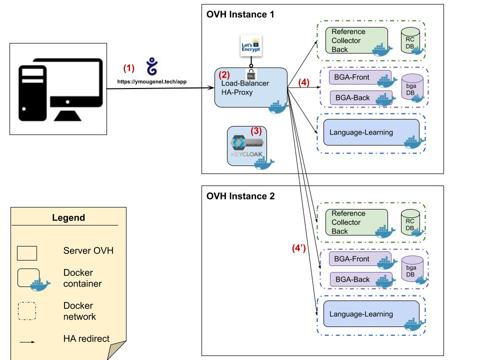

The current infra detailed in 1 schema:
<!--more-->

Details:
1. DNS configuration: adress record (**Gandi.net**)
2. Load Balancer (**Ha-proxy**), certificate generated by Let's Encrypt
3. Access control (**Keycloak**)
4. Micro-service applications

## Stack

### Load Balancer

HA-Proxy:
* Load balance between OVH instances
* Dispatch application's Requests
* Handles SSL termination

### Let's encrypt
Open certificate authority: Montly generates a new SSL certificate.

Configuration: [Let's encrypt  with HA-Proxy](https://serversforhackers.com/c/letsencrypt-with-haproxy)

### Keycloak
Authentification server for applications  
[-> Github project](https://github.com/ymougenel/my-keycloak/tree/develop)
