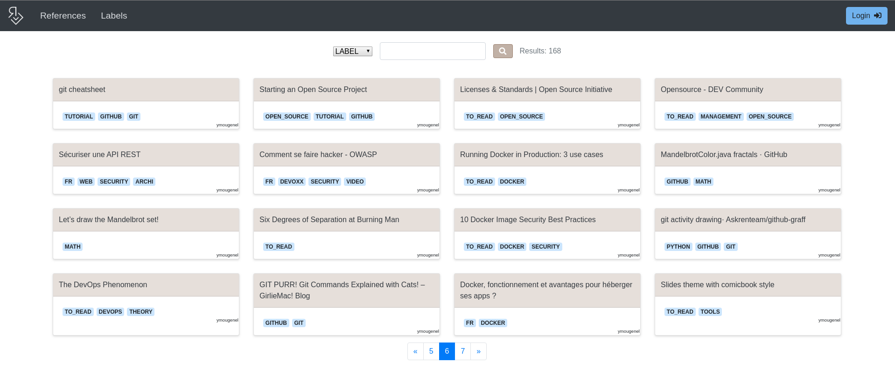

A web site that helps you gather, store and share references:  
[https://ymougenel.tech/references](https://ymougenel.tech/references)
<!--more-->

Switching between computers and browsers made my history bookmarks quite messy. 

Reference Collector is designed to keep track of the articles I read, and share those easily.

Used for almost a year now, I decided to make the project public: the 1.0.0 release add a Keycloak authentification feature.

## Technical environment
* Dev: Kotlin, Springboot 2 & thymeleaf
* CI/CD: Docker, jenkins & ansible
* Server: Centos7, Ha-proxy & let's encrypt
