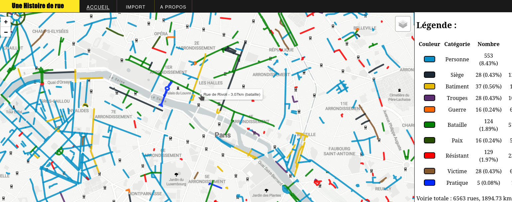

**[Histoire de Rue](https://streets-highlight.netlify.app/about)** presents a cartographic view of the history of Paris, in collaboration with the YouTuber/Historian [Sur le champ](https://www.youtube.com/@Surlechamp).  

It is an innovative web platform that enables users to explore streets imported from a CSV file.  

This [open-source project](https://github.com/ymougenel/streets_highlight) aims to provide an accessible and interactive way to visualize urban data.
<!--more-->
### Data Source

The data showcased on the homepage is sourced from OpenData Paris, meticulously labeled by "Sur le Champs". This ensures that users are viewing accurate and well-organized information.
The labeled streets offer a comprehensive insight into the street histories and specifics, making it a valuable resource for urban explorers and data enthusiasts alike.

### Import Your Map

One of the standout features of Histoire de Rue is the ability to import your own map. Users can simply upload a CSV file to view their data in a dynamic map format.  
This feature broadens the application's usability, allowing for customized data visualization based on individual needs or research requirements.

## Technical Stack

The website is built using straightforward tech stack to ensure both functionality and ease of use:

- **HTML/CSS/Vanilla JS**: These core technologies form the backbone of the web interface, providing a smooth and interactive user experience.
- **Leaflet**: This powerful library is used for map navigation, enabling users to seamlessly explore and interact with the maps.
- **Jawg Maps**: As the provider of customizable dynamic map backgrounds, Jawg Maps integrates Open Street Map data to offer a detailed and versatile mapping experience.

