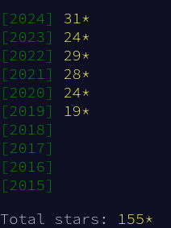

Once again, I had the pleasure of participating in the annual programming event, Advent of Code. 
It’s a tradition I look forward to every December.

<!--more-->
# The event

*Advent of Code is an Advent calendar of small programming puzzles for a variety of skill sets and skill levels that can
be solved in any programming language you like. People use them as a speed contest, interview prep, company training,
university coursework, practice problems, or to challenge each other.*

Each puzzle comes with a description, inputs, and is made of 2 parts. Resolving a part unlock a star -> there are **50
stars to collect**.

The complexity goes crescendo: puzzles get harder every day. Since the input/output are handled as plain text,
challengers are free to use the language of their choice.

# The result
This year, I stuck to Python, continuing my journey to push myself further and test the limits of my problem-solving skills.
It’s always a thrill to wake up (or stay up late) for the next challenge, knowing that each day brings something new and often unexpected.

In the end, I’m proud to say that I managed to surpass my performance from previous years. While I’m still a bit frustrated by a few unfinished puzzles, I’m more motivated than ever to come back stronger next year.

Here’s to continuous learning and growth—see you next Advent of Code! 🎄👨‍💻